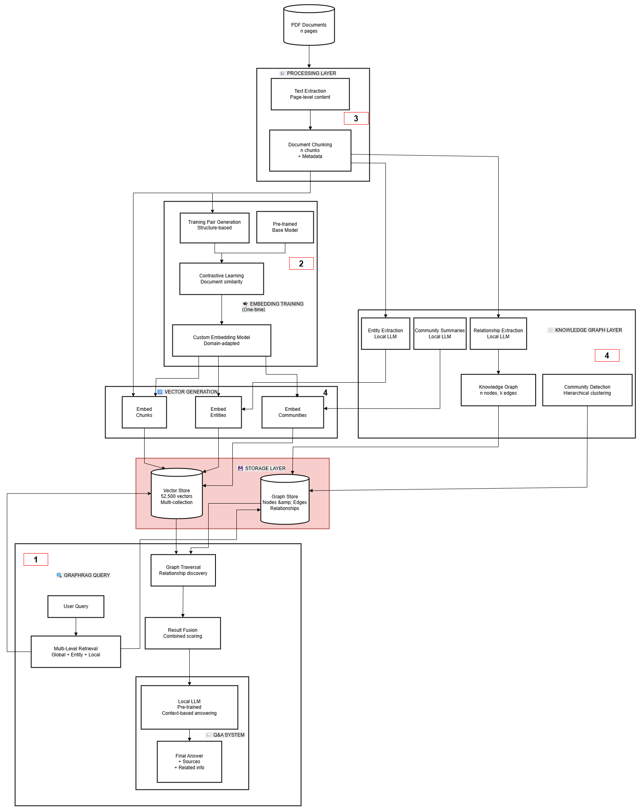

# SE- Datamodel GraphRAG: Domain-Specific Document Intelligence

Train custom embeddings from PDFs using contrastive learning and build knowledge graphs for intelligent document retrieval with local LLMs.


## Overview

Transform PDF document collections into an intelligent knowledge base through:
- **Custom Embedding Training**: Domain-adapted embeddings via contrastive learning (no Q&A generation needed)
- **Knowledge Graph Construction**: Entity and relationship extraction with local LLMs
- **GraphRAG Retrieval**: Multi-level search combining vectors and graph traversal
- **Local Q&A**: Answer generation using Llama 3.1 70B (completely on-premise)

## Key Features

- ✅ **No Q&A Pair Generation**: Trains from document structure automatically
- ✅ **Fully Local**: Complete privacy, no cloud APIs (Ollama + local models)
- ✅ **Research-Based**: Built on SimCSE, BGE, E5, and Microsoft GraphRAG papers
- ✅ **Production-Ready**: Based on proven open-source implementations
- ✅ **Multi-PDF Support**: Handles multiple documents per project with cross-document understanding

## Architecture



**8 Core Components**:

1. **PDF Documents** → 2. **Processing** (extract & chunk) → 3. **Embedding Training** (contrastive learning) + 4. **Knowledge Graph** (entities & relations) → 5. **Vector Generation** → 6. **Storage** (Neo4j/ChromaDB) → 7. **GraphRAG Query** (multi-level retrieval) → 8. **Q&A System** (local LLM)

See [Architecture Documentation](docs/architecture.md) for details.

## Quick Start

### Installation

```bash
# Clone repository
git clone https://github.com/your-org/pdf-to-graphrag.git
cd pdf-to-graphrag

# Install dependencies
pip install -r requirements.txt

# Setup Ollama (for local LLM)
bash scripts/setup_ollama.sh

# Setup Neo4j (optional - can use ChromaDB)
bash scripts/setup_neo4j.sh
```

### Basic Usage

```python
from src.processing import PDFExtractor, Chunker
from src.training import PairGenerator, EmbeddingTrainer
from src.graph import EntityExtractor, GraphBuilder
from src.retrieval import GraphRAGRetriever

# 1. Process PDFs
extractor = PDFExtractor()
chunker = Chunker(chunk_size=1000, overlap=200)
chunks = chunker.chunk(extractor.extract("path/to/pdfs/"))

# 2. Train custom embeddings
pair_gen = PairGenerator()
pairs = pair_gen.generate_from_structure(chunks)  # No Q&A needed!

trainer = EmbeddingTrainer(base_model="BAAI/bge-large-en-v1.5")
custom_model = trainer.train(pairs, epochs=3, batch_size=32)

# 3. Build knowledge graph
entity_ext = EntityExtractor(llm_model="llama3.1:70b")
entities = entity_ext.extract(chunks)

graph_builder = GraphBuilder()
graph = graph_builder.build(entities, chunks)

# 4. Query with GraphRAG
retriever = GraphRAGRetriever(custom_model, graph)
results = retriever.retrieve("What are the voltage requirements?")

print(results)
```

See [examples/](examples/) for complete workflows.

## Documentation

- **[Architecture Guide](docs/architecture.md)**: Complete system design
- **[Contrastive Learning](docs/contrastive-learning.md)**: Training methodology explained
- **[GraphRAG](docs/graphrag.md)**: Multi-level retrieval approach
- **[Installation Guide](docs/installation.md)**: Detailed setup instructions
- **[API Reference](docs/api.md)**: Function and class documentation

## Examples

- `examples/01_process_pdfs.py` - PDF extraction and chunking
- `examples/02_train_embeddings.py` - Custom model training
- `examples/03_build_graph.py` - Knowledge graph construction
- `examples/04_query_system.py` - GraphRAG queries
- `examples/end_to_end.py` - Complete pipeline

## Research Foundation

This project is built on proven research:

- **SimCSE** (Princeton NLP, 2021): Unsupervised contrastive learning
  - Paper: https://arxiv.org/abs/2104.08821
  - Shows structure-based training works

- **BGE Models** (BAAI, 2023): State-of-the-art embeddings
  - Paper: https://arxiv.org/abs/2309.07597
  - Our base model choice

- **E5 Embeddings** (Microsoft, 2022): Weak supervision from structure
  - Paper: https://arxiv.org/abs/2212.03533
  - Validates document-based training

- **GraphRAG** (Microsoft Research, 2024): Graph-based retrieval
  - GitHub: https://github.com/microsoft/graphrag
  - Multi-level search architecture

## Requirements

### Hardware
- **GPU**: 1-4x NVIDIA RTX 4090 (24GB) or 1-2x A100 (40-80GB)
- **RAM**: 64-128GB
- **Storage**: 1-2TB SSD

### Software
- Python 3.10+
- PyTorch 2.0+
- Ollama (for local LLM)
- Neo4j 5.x or ChromaDB (for storage)

## Technology Stack

| Component | Technology |
|-----------|------------|
| PDF Processing | PyMuPDF |
| Embedding Training | PyTorch, sentence-transformers |
| Base Model | bge-large-en-v1.5 (BAAI) |
| Local LLM | Llama 3.1 70B (via Ollama) |
| Vector DB | ChromaDB / Qdrant / Neo4j |
| Graph DB | Neo4j / NetworkX |
| API | FastAPI |

## Contributing

Contributions welcome! Please:
1. Fork the repository
2. Create a feature branch
3. Make your changes
4. Submit a pull request

See [CONTRIBUTING.md](CONTRIBUTING.md) for guidelines.

```

And please cite the foundational research:
- SimCSE: Gao et al. (2021)
- BGE: Xiao et al. (2023)
- GraphRAG: Edge et al. (2024)


## Acknowledgments

Built on excellent open-source work:
- [sentence-transformers](https://github.com/UKPLab/sentence-transformers) by UKPLab
- [GraphRAG](https://github.com/microsoft/graphrag) by Microsoft Research
- [Ollama](https://ollama.ai/) for local LLM serving
- [Neo4j](https://neo4j.com/) for graph database

Special thanks to the research teams at Princeton NLP, BAAI, and Microsoft Research.


