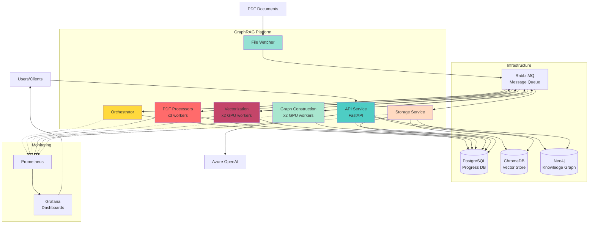
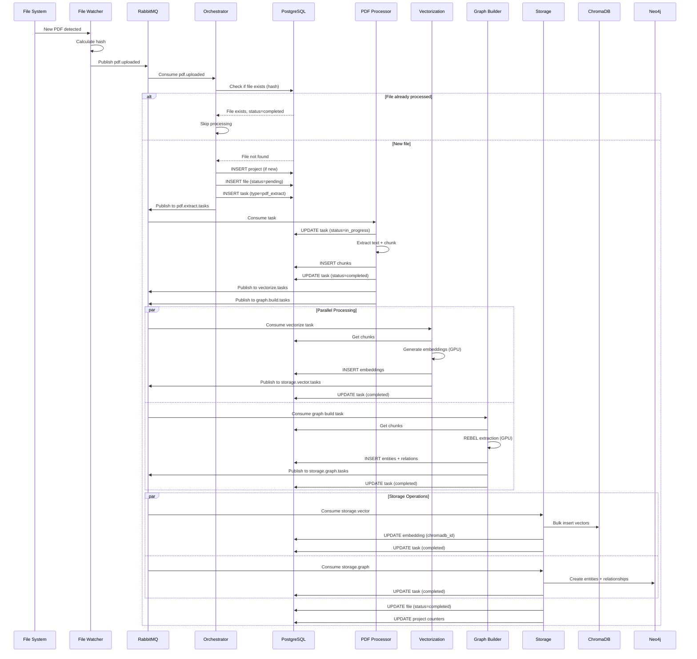
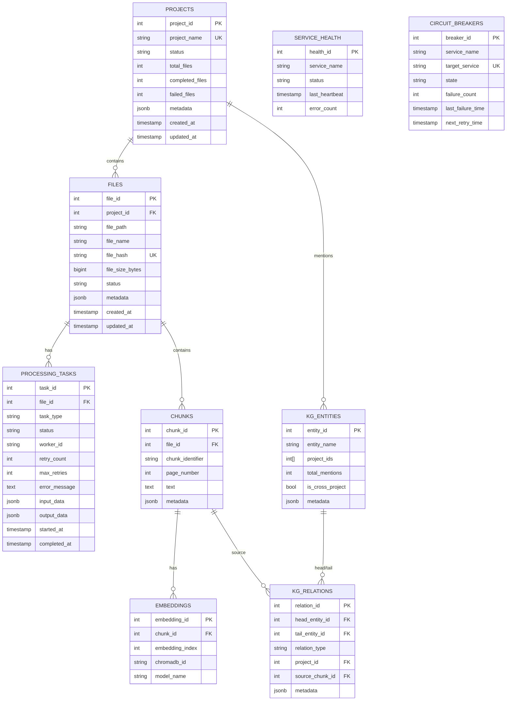
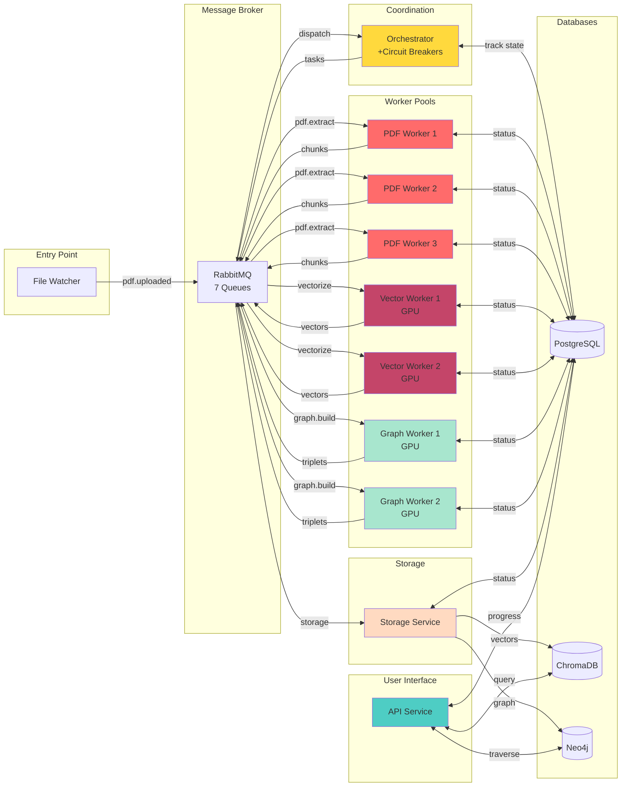
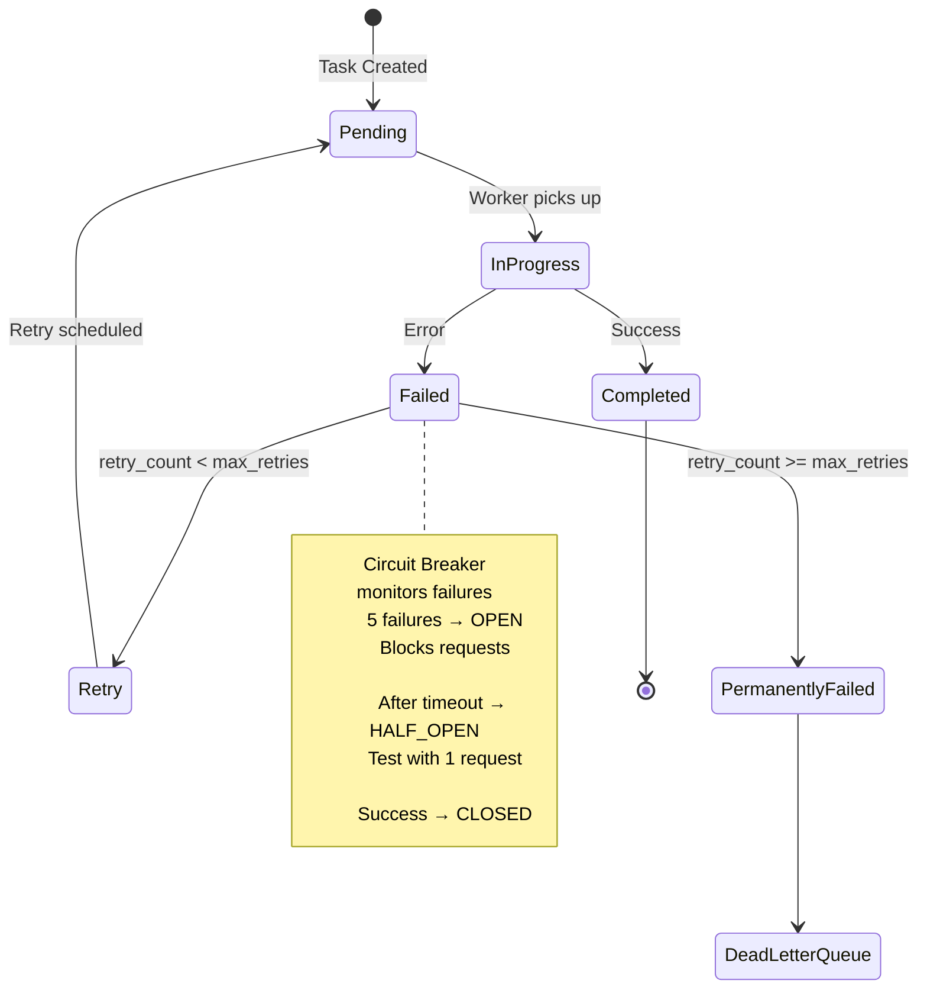

# Architecture Diagrams - Microservices GraphRAG

## 1. System Context Diagram



## 2. Data Flow Diagram



## 3. Database Schema Diagram



## 4. Service Communication Diagram



## 5. Retry & Circuit Breaker State Machine



## 6. Deployment Architecture

```
Production Environment:

┌─────────────────────────────────────────────────────────────┐
│                      Docker Swarm / Kubernetes               │
├─────────────────────────────────────────────────────────────┤
│                                                              │
│  ┌──────────┐  ┌──────────┐  ┌──────────┐                 │
│  │ Worker 1 │  │ Worker 2 │  │ Worker 3 │  ← Auto-scaling │
│  │  Node    │  │  Node    │  │  Node    │                 │
│  ├──────────┤  ├──────────┤  ├──────────┤                 │
│  │ PDF x3   │  │ PDF x3   │  │ PDF x3   │                 │
│  │ Vec x2   │  │ Vec x2   │  │ Vec x2   │                 │
│  │ Graph x2 │  │ Graph x2 │  │ Graph x2 │                 │
│  └──────────┘  └──────────┘  └──────────┘                 │
│                                                              │
│  ┌──────────────────────────────────────┐                  │
│  │     Shared Services (Single)         │                  │
│  ├──────────────────────────────────────┤                  │
│  │ • RabbitMQ (clustered)              │                  │
│  │ • PostgreSQL (primary + replicas)   │                  │
│  │ • ChromaDB (distributed)            │                  │
│  │ • Neo4j (clustered)                 │                  │
│  │ • API (load balanced)               │                  │
│  │ • Prometheus + Grafana              │                  │
│  └──────────────────────────────────────┘                  │
└─────────────────────────────────────────────────────────────┘
```

## 7. Security Architecture

```
External → Nginx (SSL/TLS) → API Service (JWT Auth) → Internal Services

Authentication Flow:
1. User → API: Login (username/password)
2. API → PostgreSQL: Validate credentials
3. API → User: JWT token
4. User → API: Request + JWT
5. API: Validate JWT
6. API → Services: Process request

Internal Communication:
- Service-to-service: mTLS or service mesh (Istio)
- Database: Connection pooling with credentials from secrets
- RabbitMQ: User/password authentication
```

## 8. Scaling Strategy

```
Load Distribution:

Light Load (< 100 PDFs/day):
├─ PDF Processors: 2 workers
├─ Vectorization: 1 worker (GPU)
├─ Graph Building: 1 worker (GPU)
└─ Storage: 1 service

Medium Load (100-1000 PDFs/day):
├─ PDF Processors: 5 workers
├─ Vectorization: 2 workers (GPU)
├─ Graph Building: 2 workers (GPU)
└─ Storage: 2 services

Heavy Load (> 1000 PDFs/day):
├─ PDF Processors: 10+ workers (auto-scale)
├─ Vectorization: 4+ workers (multi-GPU)
├─ Graph Building: 4+ workers (multi-GPU)
└─ Storage: 3+ services (partitioned)

Bottleneck Identification:
- Monitor RabbitMQ queue depths
- Track PostgreSQL task status distribution
- Watch GPU utilization
- Auto-scale based on queue backlog
```

## 9. Failure Recovery

```
Failure Scenarios & Recovery:

1. Worker Crash:
   ├─ RabbitMQ: Message not ACKed → requeued
   ├─ PostgreSQL: Task status=in_progress → reset to pending
   └─ Orchestrator: Detects stale task → reassigns

2. Database Unavailable:
   ├─ Circuit Breaker: Opens after 5 failures
   ├─ Workers: Cache operations locally
   ├─ Queue: Messages accumulate
   └─ Recovery: Circuit breaker closes → replay

3. GPU Out of Memory:
   ├─ Worker: Catches OOM error
   ├─ Retry: Reduces batch size
   └─ Success: Completes with smaller batches

4. Network Partition:
   ├─ RabbitMQ: Message TTL expires
   ├─ Worker: Health check fails
   └─ Orchestrator: Marks worker as down → redistributes

5. Corrupt PDF:
   ├─ PDF Processor: Extraction fails
   ├─ Retry: 3 attempts with backoff
   ├─ Permanent Failure: Moves to DLQ
   └─ Admin: Manual review required
```

## 10. Progress Tracking

```
Real-time Progress Dashboard:

Project: alpha_erp_system
├─ Total Files: 100
├─ Completed: 75 (75%)
├─ In Progress: 15 (15%)
├─ Failed: 5 (5%)
├─ Pending: 5 (5%)
│
├─ Stage Breakdown:
│   ├─ PDF Extraction: 100/100 ✓
│   ├─ Vectorization: 85/100 (85%)
│   ├─ Graph Building: 80/100 (80%)
│   └─ Storage: 75/100 (75%)
│
└─ ETA: 45 minutes (based on current throughput)

Query Endpoint:
GET /api/projects/alpha_erp_system/status

Response:
{
  "project_name": "alpha_erp_system",
  "progress": {
    "total_files": 100,
    "completed": 75,
    "in_progress": 15,
    "failed": 5,
    "pending": 5,
    "percentage": 75.0
  },
  "stages": {
    "pdf_extraction": {"completed": 100, "total": 100},
    "vectorization": {"completed": 85, "total": 100},
    "graph_building": {"completed": 80, "total": 100},
    "storage": {"completed": 75, "total": 100}
  },
  "eta_minutes": 45,
  "throughput_files_per_hour": 120
}
```

---

These diagrams can be rendered using:
- **Mermaid**: Supported in GitHub, VS Code, many markdown viewers
- **PlantUML**: For more detailed diagrams
- **draw.io**: For custom architecture diagrams

Copy the mermaid code blocks into tools like:
- https://mermaid.live/ (online viewer)
- VS Code with Mermaid extension
- GitHub markdown (renders automatically)
